## 349.两个数组的交集

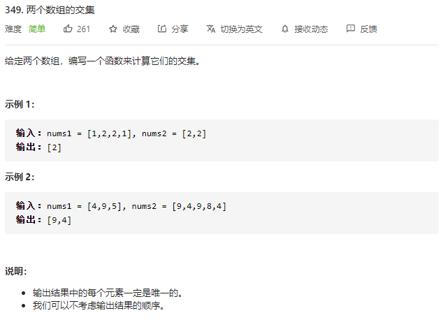

```python 
class Solution(object):
    def intersection(self, nums1, nums2):
        """
        :type nums1: List[int]
        :type nums2: List[int]
        :rtype: List[int]
        """
        
        rec1 = collections.defaultdict(int)
        rec2 = collections.defaultdict(int)

        for num in nums1:
            rec1[num] += 1
        
        for num in nums2:
            rec2[num] += 1

        res = []

        for i in rec1.keys():
            if i in rec2:
                res.append(i)

        return res
        
```

### Tips

* 构建哈希表


## 941. 有效得山脉数组

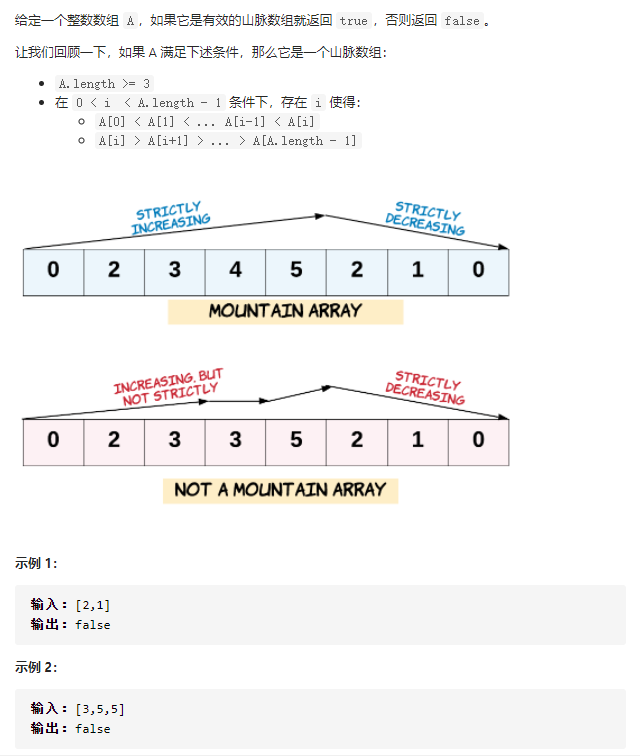

```python
class Solution(object):
    def validMountainArray(self, A):
        """
        :type A: List[int]
        :rtype: bool
        """

        i = 0
        n = len(A)

        while i < n - 1 and A[i] < A[i + 1]:
            i += 1

        # 封顶不能是头尾
        if i == 0 or i == n - 1:
            return False

        while i < n - 1 and A[i] > A[i + 1]:
            i += 1

        if i != n - 1:
            return False

        return True
```

### Tips

* 线性扫描列表，使用while循环
* 峰顶不能是头尾


## 57.插入区间

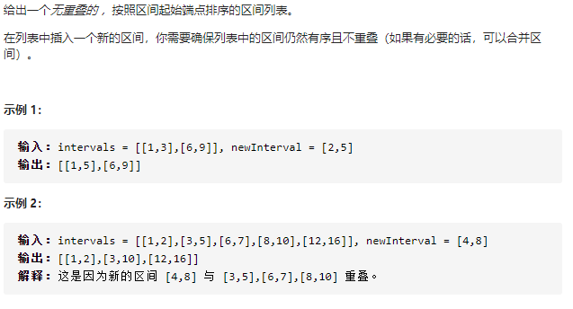

```python
class Solution(object):
    def insert(self, intervals, newInterval):
        """
        :type intervals: List[List[int]]
        :type newInterval: List[int]
        :rtype: List[List[int]]
        """
        n = len(intervals)

        # 新加区域是否完全超过了此区域
        def is_after(area1, area2):
            if area1[0] > area2[1]:
                return True
        # 新加区域与该区域是否重合
        def is_overlayed(area1, area2):
            if area1[0] > area2[1] or area2[0] > area1[1]:
                return False
            else:
                return True
        # 合并重合区域
        def merge(area1, area2):
            new_area = []
            new_area.append(min(area1[0], area2[0]))
            new_area.append(max(area1[1], area2[1]))
            
            return new_area

        # 寻找第一个重合区域索引
        i = 0
        while i < n and is_after(newInterval, intervals[i]):
            i += 1
        
        # 寻找第一个脱离重合的区域索引
        j = i
        temp = newInterval
        while j < n and is_overlayed(newInterval, intervals[j]):
            temp = merge(temp, intervals[j])
            j += 1

        # 切片返回
        return intervals[:i] + [temp] + intervals[j:]

```

### Tips

* 遍历，寻找第一个重合区域，记录索引i
* 开始合并，并继续遍历，直到脱离重合
* 切片返回


## 1356.根据数字二进制下1的数目排序

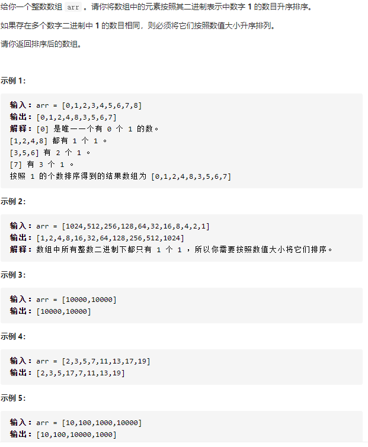

```python
class Solution(object):
    def sortByBits(self, arr):
        """
        :type arr: List[int]
        :rtype: List[int]
        """
        result = arr[:]

        def count_one(num):
            res = 0
            while num:
                res += num % 2
                num = num / 2
            return res
        
        result.sort()
        result.sort(key=lambda x:count_one(x))

        return result
```

### Tips:

* 利用python两次排序不会改变第一次排序位置的特性，进行双键排序


## 973. 最接近远点的K个点

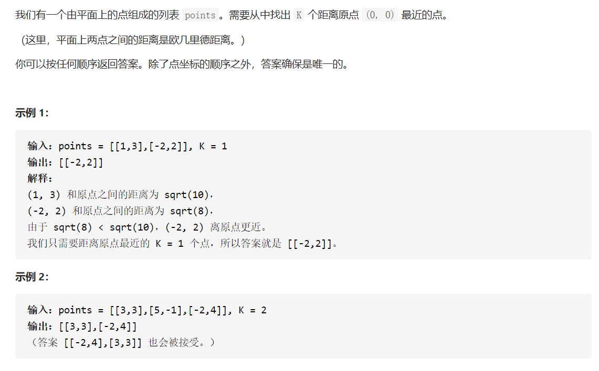

```python
class Solution(object):
    def kClosest(self, points, K):
        """
        :type points: List[List[int]]
        :type K: int
        :rtype: List[List[int]]
        """
        n = len(points)
        points_t = points[:]

        def get_distance(point):
            return point[0] ** 2 + point[1] ** 2
        
        # 对points[left, right]根据distance排序
        def partition(left, right):
            l = left
            r = right

            pivot = left

            while l < r:
                while l < r and get_distance(points_t[r]) > get_distance(points_t[pivot]):
                    r -= 1
                while l < r and get_distance(points_t[l]) <= get_distance(points_t[pivot]):
                    l += 1
                points_t[l], points_t[r] = points_t[r], points_t[l]

            points_t[left], points_t[l] = points_t[l], points_t[pivot]

            return l

        
        # 开始二分查找
        left = 0
        right = n - 1

        while True:
            index = partition(left, right)
            # 一定注意这里的逻辑控制！！！！！！！！！不然一直出错，想清楚！
            if index == K - 1:
                return points_t[:K]
            if index > K - 1:
                right = index - 1
            else:
                left = index + 1

```

### Tips

* 类似数组第k大的元素
* 进行二分搜索


## 31.下一个排列

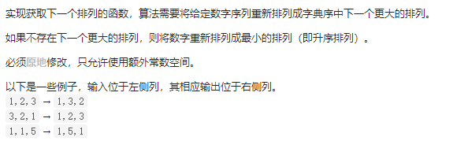

```python
class Solution(object):
    def nextPermutation(self, nums):
        """
        :type nums: List[int]
        :rtype: None Do not return anything, modify nums in-place instead.
        """

        n = len(nums)

        i = n - 2

        while i >= 0 and nums[i] >= nums[i + 1]:
            i -= 1
        # 找到第一个上升序列（从前看）
        # 此时记录当前索引i，然后再此后往前开始寻找第一个大于i的数索引j
        # 如果本来数列就是上升数列，此时i为-1, 直接跳过下面步骤

        if i >= 0:
            j = n - 1
            while j >= 0 and nums[j] <= nums[i]:
                j -= 1
            # 进行交换
            nums[i], nums[j] = nums[j], nums[i]

        # 然后将索引i之后的数进行升序排列
        # 因为[i + 1, n - 1]一定是一个降序数列，所以首尾交换即可

        left = i + 1
        right = n - 1

        while left < right:
            nums[left], nums[right] = nums[right], nums[left]
            left += 1
            right -= 1
```

### Tips

* 两遍 ***从后往前*** 扫描
* 第一遍找到第一个升序，第二遍找到第一个大于i的j，对换
* 然后将i之后的数升序排列


## 514.自由之路

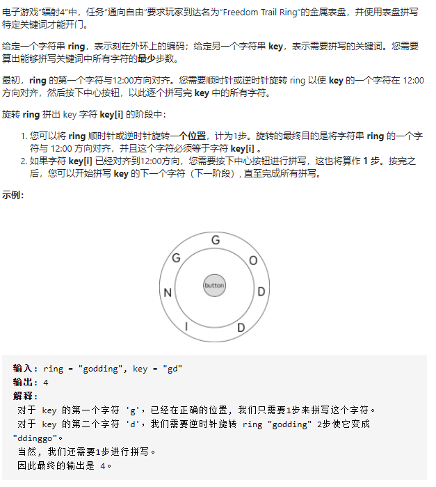

```python
class Solution(object):
    def findRotateSteps(self, ring, key):
        """
        :type ring: str
        :type key: str
        :rtype: int
        """
        ring_length = len(ring)
        key_length = len(key)

        # 记录key中每个单词在ring中的所有索引位置
        position = collections.defaultdict(list)
        for c in key:
            for i, w in enumerate(ring):
                if w == c:
                    position[c].append(i)
        
        dp = [[float('inf') for _ in range(ring_length)] for _ in range(key_length)]

        # 遍历(key的首字母在ring中的所有索引)，初始化第一行
        for i in position[key[0]]:
            dp[0][i] = min(i, ring_length - i) + 1

        for i in range(1, key_length):
            for j in position[key[i]]:
                # 遍历上一行
                for k in position[key[i - 1]]:
                    dp[i][j] = min(dp[i][j], dp[i - 1][k] + min(abs(j - k), ring_length - abs(j - k)) + 1)
        
        return min(dp[i])
```

### Tips

* `dp[i][j]`定义为ring的第J个字母对正的时候，完成了KEY的前I个字母的拼写，所需要的最小步数
* 


## 922.按奇偶排序数组II

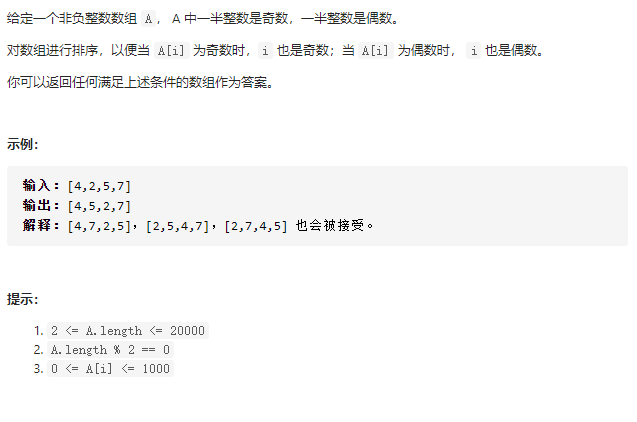

```python
class Solution(object):
    def sortArrayByParityII(self, A):
        """
        :type A: List[int]
        :rtype: List[int]
        """

        def is_odd(number):
            return number % 2 == 1

        odd_nums = []
        even_nums = []

        for num in A:
            if is_odd(num):
                odd_nums.append(num)
            else:
                even_nums.append(num)

        res = []
        for i in range(len(A) / 2):
            res.append(even_nums[i])
            res.append(odd_nums[i])

        return res  
```

### Tips

* 没什么tips


## 1122.数组的相对排序

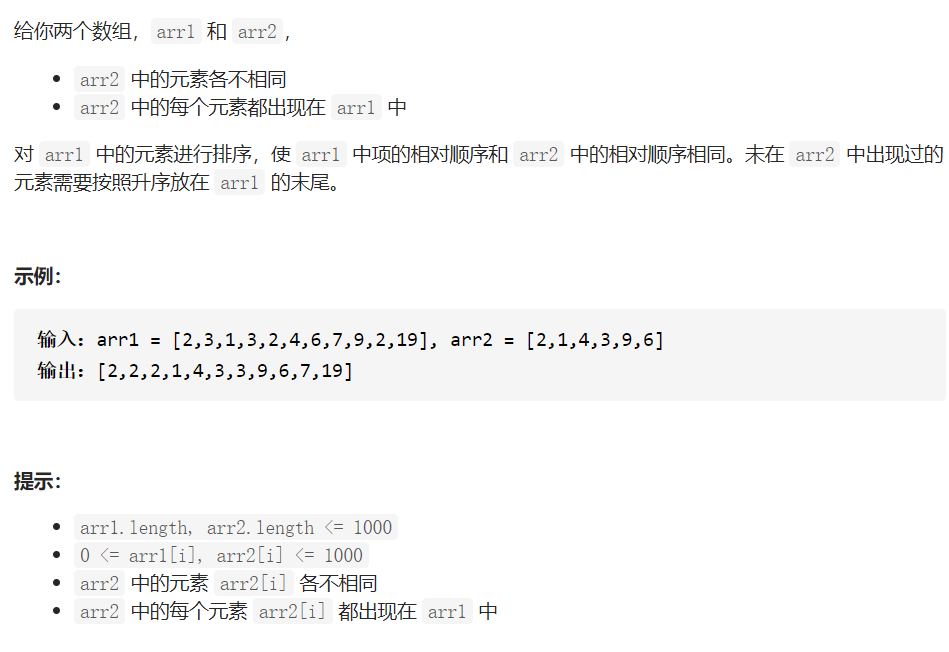

```python
class Solution(object):
    def relativeSortArray(self, arr1, arr2):
        """
        :type arr1: List[int]
        :type arr2: List[int]
        :rtype: List[int]
        """
        
        # 构建哈希表，键为元素值，值为索引
        rank = {}
        for i, number in enumerate(arr2):
            rank[number] = i

        # 构建自定义排序函数
        # 若两个值都在哈希表中，则根据元组第二个元素，即是他们的索引大小来排序
        # 若只有其中一个在哈希表，则没在表中的元素更大
        # 若两个都不在哈希表，则根据他们本身的值来排序
        def order(number):
            return (0, rank[number]) if number in rank else (1, number)

        arr1.sort(key=order)

        return arr1
```


### Tips

* 自定义排序函数，利用内置`sort()`函数排序


## 406. 根据身高重建队列

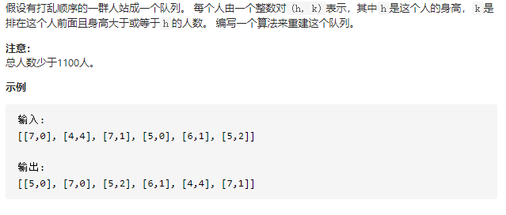

```python
class Solution(object):
    def reconstructQueue(self, people):
        """
        :type people: List[List[int]]
        :rtype: List[List[int]]
        """
		# 首先按照身高第一序，以及位置第二序排列
        people.sort(key=lambda x: (-x[0], x[1]))
        res = []
        # 依次将排序的结果插入结果数组中
        # 可以这么想，后插入的任何元素，随便X什么位置，对于已经插入的元素来说，都是合规合法的
        # 因为后插入的元素一定比之前的元素小（就算相同的元素，我们也可以认为后来的仍然是小那么一点点）
        # 所以不会影响他的位置序列
        # 所以每个元素只要按照他的序列号插入（元组第二个元素），就可以保证他本身的合法性
        for person in people:
            res.insert(person[1], person)
        return res
```

### Tips

* 有点东西


## 1030.距离顺序排列矩阵单元格

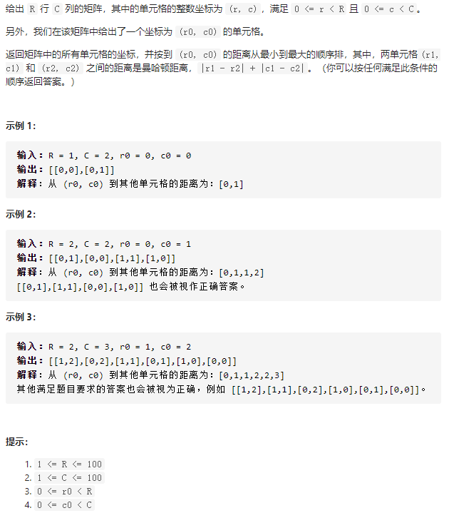

```python
class Solution(object):
    def allCellsDistOrder(self, R, C, r0, c0):
        """
        :type R: int
        :type C: int
        :type r0: int
        :type c0: int
        :rtype: List[List[int]]
        """

        directions = [(1, 1), (1, -1), (-1, -1), (-1, 1)]
        res = [(r0, c0)]

        # 矩阵中有可能的最远曼哈顿距离
        max_distance = max(r0, R - 1- r0) + max(c0, C - 1 - c0)

        # 起始坐标
        column = c0
        row = r0
        # 按照曼哈顿距离遍历所有点
        for distance in range(1, max_distance + 1):
            row -= 1
            # 从上顶点开始，顺时针遍历相同距离点
            for i, (dr, dc) in enumerate(directions):
                # 沿着这条边一直走，一直把这条边走完
                # 判断条件很关键
                while (i % 2 == 0 and row != r0) or (i % 2 != 0 and column != c0):
                    # 如果在矩阵范围内,则添加此点
                    if 0 <= row < R and 0 <= column < C:
                        res.append([row, column])
                    # 继续沿着这条边走
                    row += dr
                    column += dc
        
        return res
```

### Tips

* 根据距离来遍历所有点

* 主要注意如何判断“沿着这条边一直走”

* 也可以暴力遍历之后按照距离排序


## 147.对链表进行插入排序

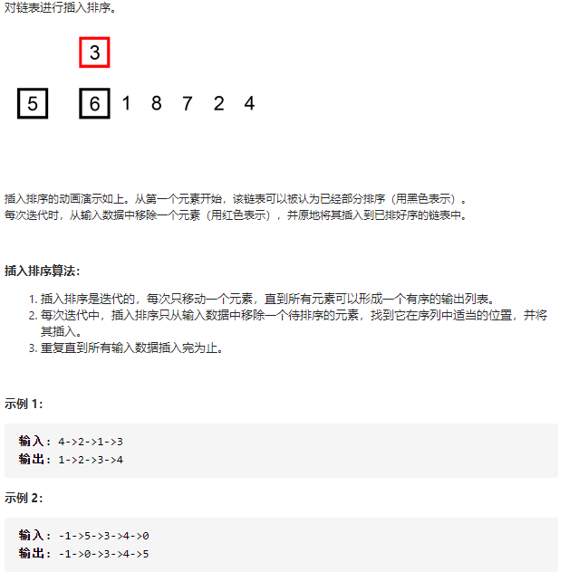

```python
# Definition for singly-linked list.
# class ListNode(object):
#     def __init__(self, x):
#         self.val = x
#         self.next = None

class Solution(object):
    def insertionSortList(self, head):
        """
        :type head: ListNode
        :rtype: ListNode
        """

        if not head:
            return None

        dummy_head = ListNode(float('-inf'))
        dummy_head.next = head

        last_sorted = head
        current = head.next

        while last_sorted.next:
            if current.val >= last_sorted.val:
                last_sorted = last_sorted.next
                current = current.next

            else:
                # 首先将这个小值节点拿出来
                last_sorted.next = current.next

                # 然后从头开始遍历，寻找插入点
                insert = dummy_head
                while current.val >= insert.next.val:
                    insert = insert.next
                current.next = insert.next
                insert.next = current

                # current继续往后走
                # last sorted 不动
                current = last_sorted.next

        return dummy_head.next

```

### Tips

* 每次遇到更小值需要把他插到前面的时候，需要重新从前往后进行遍历，寻找插入位置


## 222.完全二叉树的节点个数

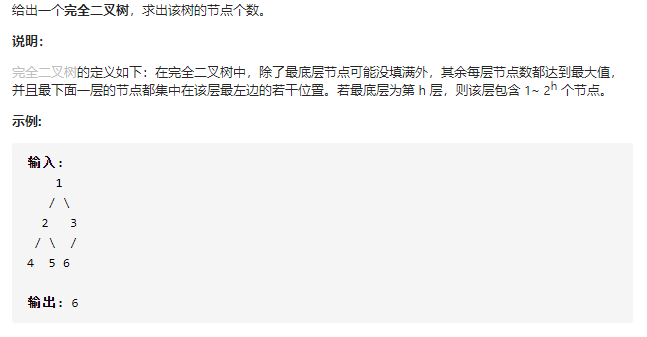

```python
# Definition for a binary tree node.
# class TreeNode(object):
#     def __init__(self, x):
#         self.val = x
#         self.left = None
#         self.right = None

class Solution(object):
    def countNodes(self, root):
        """
        :type root: TreeNode
        :rtype: int
        """
		
        # 统计树高度
        def count_level(root):
            res = 0
            while root:
                root = root.left
                res += 1
            return res

        def count_node(root):
            if not root:
                return 0
			
            # 分别统计左右子树高度
            left_depth = count_level(root.left)
            right_depth = count_level(root.right)
            
            if left_depth == right_depth:
                # 说明左子树是满树
                return (1 << left_depth) + count_node(root.right)

            else:
                # left_depth > right_depth
                # 说明右子树是满树
                return (1 << right_depth) + count_node(root.left)

        return count_node(root) 
```

### Tips

* 利用完全树的特点，可以不用遍历所有节点
* 复杂度O（logn * logn）


## 1370. 上升下降字符串

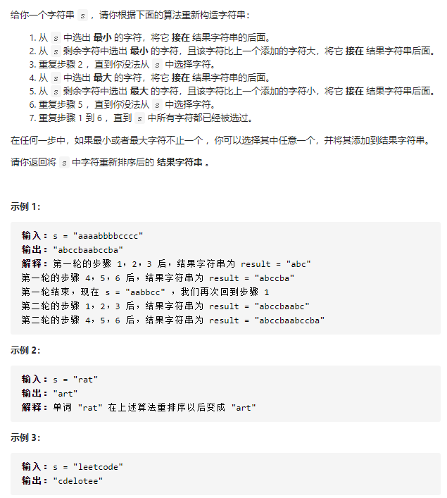

```python
class Solution(object):
    def sortString(self, s):
        """
        :type s: str
        :rtype: str
        """

        record = [0 for _ in range(26)]

        for c in s:
            record[ord(c) - ord('a')] += 1

        res = ''
        while len(res) < len(s):
            for i in range(26):
                if record[i]:
                    res += chr(i + ord('a'))
                    record[i] -= 1

            for i in range(26)[::-1]:
                if record[i]:
                    res += chr(i + ord('a'))
                    record[i] -= 1

        return res

```

### Tips

* 使用哈希表记录每个字母个数
* 按照字母顺序不断采集哈希表中值非零的元素


## 164. 最大间距

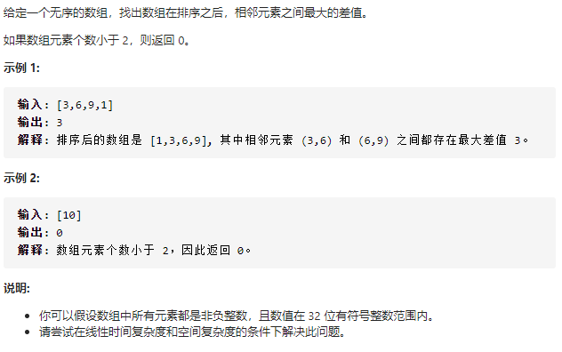

```python
class Solution(object):
    def maximumGap(self, nums):
        """
        :type nums: List[int]
        :rtype: int
        """

        n = len(nums)
        if n < 2:
            return 0

        maximum = max(nums)
        minimum = min(nums)
		# 按照平均差值等分整个值域
        average_gap = max(1, (maximum - minimum) / (n - 1))
        # +1 保证最大值也能被分配一个桶
        nums_buckets = (maximum - minimum) / average_gap + 1


        # 每个桶存放落在此区间的最大值和最小值
        buckets = [[-1, -1] for _ in range(nums_buckets)]

        for i, num in enumerate(nums):
            # 查找这个数属于哪个桶
            idx = (num - minimum) // average_gap
            if buckets[idx][0] == -1:
                buckets[idx][0] = num
                buckets[idx][1] = num
            else:
                buckets[idx][0] = min(num, buckets[idx][0])
                buckets[idx][1] = max(num, buckets[idx][1])

        res = 0
        prev = -1
        for i in range(nums_buckets):
            if buckets[i][0] == -1:
                # 当前桶没有元素
                # 继续往后找
                continue
            else:
                # 记录这个桶的最小值，和前一个非空桶的最大值之差
                res = max(buckets[i][0] - buckets[prev][1], res)
                prev = i

        return res
```

### Tips

* 利用桶排序，在线性时间内完成


## 767.重构字符串

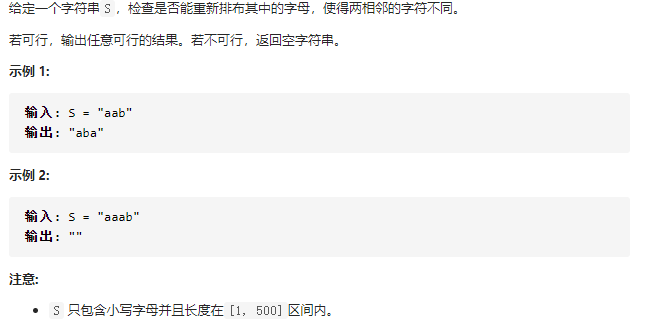

```python
class Solution(object):
    def reorganizeString(self, S):
        """
        :type S: str
        :rtype: str
        """

        n = len(S)

        record = collections.defaultdict(int)

        for c in S:
            record[c] += 1
        
        # 通过数学判断是否一定有相邻
        for count in record.values():
            if count > (n + 1) // 2:
                return ""

        count_list = record.items()
        count_list.sort(key=lambda x : -x[1])


        result = ['' for _ in range(n)]
        i = 0
        # 按照字母统计数量，从高到低
        # 先插奇数位，再插偶数位
        for letter, count in count_list:
            for _ in range(count):
                result[i] = letter
                i += 2

                if i >= n:
                    i = 1
        
        return "".join(result)
```

### tips

* 先使用数学方法判断时候能生成不相邻的字符串
* 然后按照字母数量，从高到低，先放奇数位，再放偶数位


## 976.三角形的最大周长

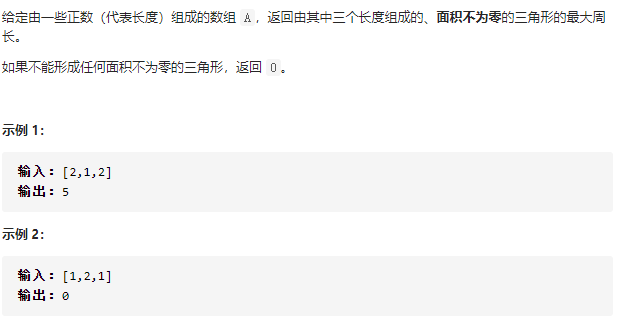

```python
class Solution(object):
    def largestPerimeter(self, A):
        """
        :type A: List[int]
        :rtype: int
        """
        
        def isvalid(edge1, edge2, edge3):
            if edge1 + edge2 <= edge3:
                return False

            if edge2 + edge3 <= edge1:
                return False

            if edge1 + edge3 <= edge2:
                return False

            return True

        if len(A) < 3:
            return 0

        n = len(A)

        A.sort()

        i = n - 1
        j = n - 2
        k = n - 3

        while not isvalid(A[i], A[j], A[k]):
            if k - 1 < 0:
                return 0
            i = j
            j = k
            k = k - 1

        return A[i] + A[j] +A[k]
```

### Tips

* 讲所有的边从大到小排列，并遍历
* 先根据几何知识判断是否能形成三角形，贪心搜索


## 493.翻转对

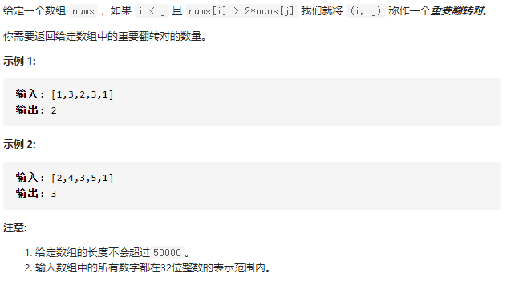

```python
class Solution(object):
    def merge(self, left, right):     
        result = []
        i = 0
        j = 0

        while i < len(left) and j < len(right):
            if left[i] <= right[j]:
                result.append(left[i])
                i += 1

            else:
                result.append(right[j])
                j += 1

        result += left[i:]
        result += right[j:]

        return result

    def merge_sort(self, nums):
        if len(nums) <= 1:
            return nums

        mid = len(nums) // 2

        left_sorted = self.merge_sort(nums[:mid])
        right_sorted = self.merge_sort(nums[mid:])

        left_length = len(left_sorted)
        right_length = len(right_sorted)
        
        j = 0
        # 利用有序数组的大小顺序
        # 快速计算左右端点分别位于两个数组的翻转对
        # 固定左端点i
        for i in range(left_length):
            # 右端点j逐个增加，直到无法满足条件
            while j < right_length and left_sorted[i] > 2 * right_sorted[j]:
                j += 1
            self.count += j
                
        return self.merge(left_sorted, right_sorted)
    
    def reversePairs(self, nums):
        """
        :type nums: List[int]
        :rtype: int
        """
        self.count = 0

        sorted_nums = self.merge_sort(nums)
        
        return self.count
```

### Tips

* 归并排序的副产物
* 在两个有序数列合并之前，进行计数操作