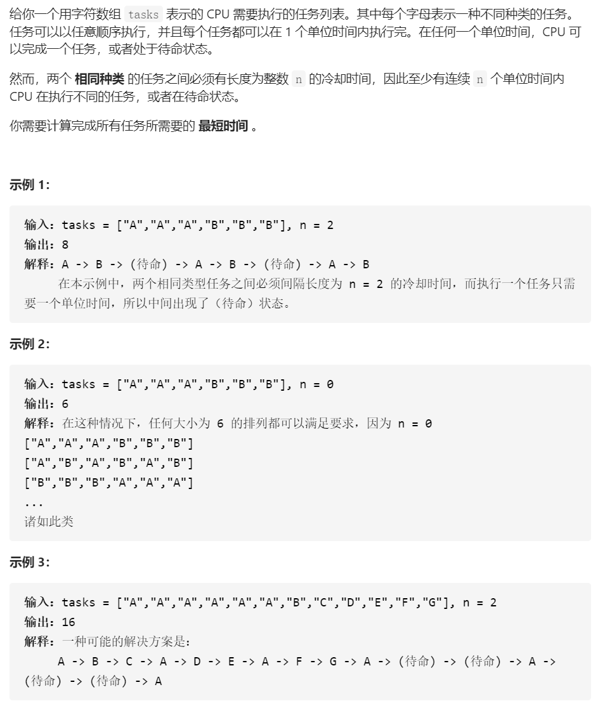

## 321.拼接最大数


```python
class Solution(object):
    def maxNumber(self, nums1, nums2, k):
        """
        :type nums1: List[int]
        :type nums2: List[int]
        :type k: int
        :rtype: List[int]
        """
        # 维护一个长度为n的最大子序列
        # 注意，不是单调递减栈
        m = len(nums1)
        n = len(nums2)

        def max_sub_sequence(nums, n):
            
            # 这个变量可以理解为更换的机会
            to_choose = len(nums) - n
            sequence = []
            i = 0
            
            # 难点1
            for num in nums:
                while to_choose and sequence and sequence[-1] < num:
                    sequence.pop()
                    to_choose -= 1
                sequence.append(num) 
            
            # 返回前n个
            return sequence[:n]

        # 返回两个位数相同的数字数列大的那个
        def bigger(list_a, list_b):
            i = 0
            while i < len(list_a):
                if list_a[i] == list_b[i]:
                    i += 1
                elif list_a[i] < list_b[i]:
                    return list_b
                else:
                    return list_a
            return list_a
            
        res = [0 for _ in range(k)]

        # x 代表从nums1中抽取x个元素
        # y 代表从nums2中抽取y个元素，然后拼接一起
        # 遍历所有的x, y组合
        for x in range(k + 1):
            
            y = k - x
            # 不能超出本身数组的个数范围
            if x <= m and y <= n:
                seq_a = max_sub_sequence(nums1, x)
                seq_b = max_sub_sequence(nums2, y)

                # 开始合并两个最大数列
                i = 0
                j = 0
                temp = []
                while seq_a and seq_b:
                    # 难点2
                    # 直接使用字典序，比较两个数组大小，可以少写很多东西
                    bigger_one = seq_a if seq_a > seq_b else seq_b
                    temp.append(bigger_one[0])
                    bigger_one.pop(0)           
                temp += seq_a
                temp += seq_b

                res = bigger(res, temp)

        return res
```

### TIPs

* 这道题确实有点变态
* 最终数列由两个数组分别出多少个数字？遍历所有可能的组合
* 第一步，找出两个数组的最大子序列，第二步，合并两个最大子序列
* 处理难点有点多


## 659.分割数组为连续子序列


```python
class Solution(object):
    def isPossible(self, nums):
        """
        :type nums: List[int]
        :rtype: bool
        """
        # 某个数字的出现次数的哈希表
        record = [0 for _ in range(max(nums) + 3)]
        # 记录以某个数字为结尾的序列的个数
        tail = [0 for _ in range(max(nums) + 3)]

        for num in nums:
            record[num] += 1

        for i in nums:
            if record[i] == 0:
                continue;
            
            # 如果可以接到已存在的序列
            elif record[i] > 0 and tail[i - 1] > 0:
                tail[i - 1] -= 1
                tail[i] += 1
                record[i] -= 1             

            # 否则另开一个序列
            elif record[i] > 0 and record[i + 1] > 0 and record[i + 2] > 0:
                record[i + 1] -= 1
                record[i + 2] -= 1
                record[i] -= 1
                tail[i + 2] += 1

            else:
                return False

        return True
```

### Tips

* 贪心解法，有点讲究
* 维护某个数字的出现次数的哈希表，维护以某个数字为结尾的序列的个数
* 遍历所有的数字，动态更新


## 621.任务调度器



```python
class Solution:
    def leastInterval(self, tasks: List[str], n: int) -> int:
        # 统计任务个数
        record = collections.Counter(tasks)

        # 计算出现次数最多的元素的次数
        # 也就是“有几行”
        max_count = max(record.values())

        # 也要计算出现最多次数的元素一共有几种
        max_value_count = sum([1 if count == max_count else 0 for count in record.values()])

        # 要么有空值
        # 要么全部排满
        return max((max_count - 1) * (n + 1) + max_value_count, len(tasks))
```

### Tips

* 想象把所有任务排成一个矩阵
* 