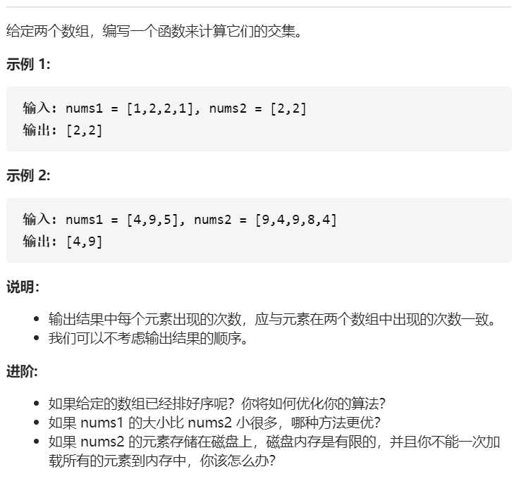
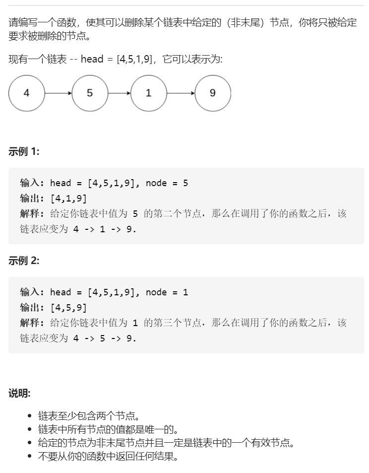
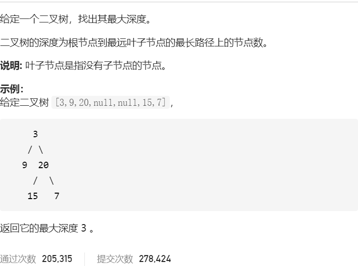
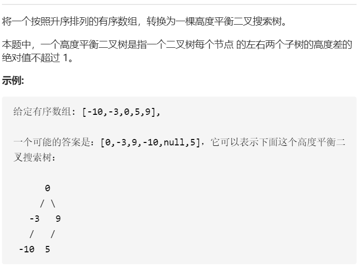
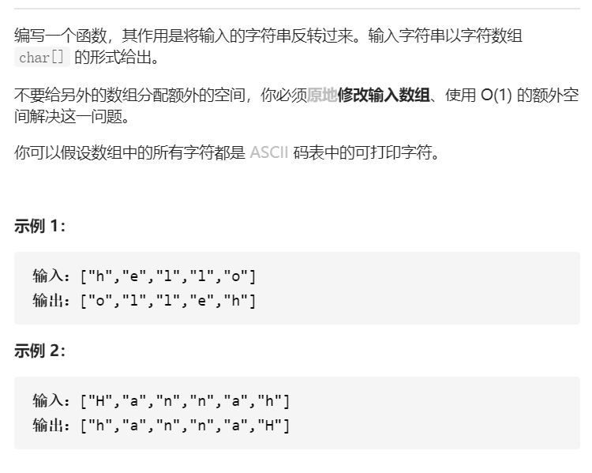
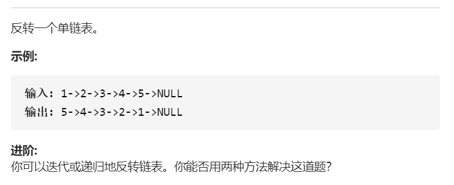

## 350.两个数组的交集2



```python
# 350.两个数组的交集

nums1 = [1,2,2,1]
nums2 = [2,2]

def intersect(nums1, nums2):
    """
    :type nums1: List[int]
    :type nums2: List[int]
    :rtype: List[int]
    """
    inter = set(nums1) & set(nums2)
    res = []
    for i in inter:
        res += [i] * min(nums1.count(i),nums2.count(i))
        
    return res
```

### Tips

* `set`的使用，可以对列表快速去重
* `count`的使用，取得交集后还需要计算重复元素的个数

```python
import collections
def intersect(nums1, nums2):
    """
    :type nums1: List[int]
    :type nums2: List[int]
    :rtype: List[int]
    """
    num1 = collections.Counter(nums1)
    num2 = collections.Counter(nums2)
    num = num1 & num2
    return list(num.elements())
```

### Tips
* collections模块中Counter对象的使用，可以使用数学运算符进行计数器的加减，也可以使用`elements()`方法返回此列表


## 237.删除链表中的节点



```python
# 237 删除链表中的节点

# Definition for singly-linked list.
class ListNode(object):
    def __init__(self, x):
        self.val = x
        self.next = None


def deleteNode(self, node):
    """
    :type node: ListNode
    :rtype: void Do not return anything, modify node in-place instead.
    """
    node.val = node.next.val
    node.next = node.next.next
```

### Tips
* 不能直接使用`next = node.next`，因为这样只是相当于简单的浅拷贝了对象，原始链表没有任何变化


## 104.二叉树的最大深度



```python
# 104.二叉树的最大深度

# Definition for a binary tree node.
class TreeNode(object):
    def __init__(self, x):
        self.val = x
        self.left = None
        self.right = None

class Solution(object):
    def maxDepth(self, root):
        """
        :type root: TreeNode
        :rtype: int
        """
        if root is None:
            return 0
        
        else:
            left_height = self.maxDepth(root.left)
            right_height = self.maxDepth(root.right)
        
        return max(left_height,right_height) + 1
```

### Tips
* 使用递归
* 当递归到节点的时候，返回0


## 108.将有序数组转换为二叉搜索树



```python
# 108.将有序数组转换为二叉搜索树
# Definition for a binary tree node.
test = [-10,-3,0,5,9]

class TreeNode(object):
    def __init__(self, x):
        self.val = x
        self.left = None
        self.right = None


def sortedArrayToBST(nums):
    """
    :type nums: List[int]
    :rtype: TreeNode
    """
    length = len(nums)
    
    if length == 0:
        return None
    
    
    # 遇到偶数择中间偏右为根节点
    mid = length // 2
    root = TreeNode(nums[mid])
    root.left = sortedArrayToBST(nums[0 : length // 2])
    root.right = sortedArrayToBST(nums[length // 2 + 1 :])
    
    return root
```

### TIPS
* 递归，遇到偶数长度，可以选择中偏左，也可以选择中偏右
* 利用Python列表切片左闭右开特性，`a[0:0] is None` `a[max_len:max_len] is None`


## 344.反转字符串



```python
# 344.反转字符串
def reverseString(self, s):
    """
    :type s: List[str]
    :rtype: None Do not return anything, modify s in-place instead.
    """

    for i in range(len(s) // 2):
        stack = s[i]
        s[i] = s[len(s) - i - 1]
        s[len(s) - i - 1] = stack
```

### Tips

* 可以使用双指针利用`while`循环


## 206.反转链表



```python
# 206.反转链表
# 迭代
# Definition for singly-linked list.
class ListNode(object):
    def __init__(self, x):
        self.val = x
        self.next = None

class Solution(object):
    def reverseList(self, head):
        """
        :type head: ListNode
        :rtype: ListNode
        """
        pre = None
        cur = head
        
        while cur:
            # 备份当前节点下一个节点
            stack = cur.next
            # 当前节点转向
            cur.next = pre
            # 前一节点前进
            pre = cur
            # 当前节点前进
            cur = stack
            
        return pre
```

### Tips
* 需要使用三指针
* 迭代从前往后，递归从后往前

```python
# 递归
class Solution(object):
    def reverseList(self, head):
        """
        :type head: ListNode
        :rtype: ListNode
        """
        if head and head.next:
            cur = head
            pre = None

            while cur.next:
                pre = cur
                cur = cur.next

            tmp = cur
            pre.next = None
            cur.next = self.reverseList(head)
        
            return tmp
        
        else:
            return head
```

### Tips

* 需要双指针
* 递归至只有一个元素的时候停止


## 136.只出现一次的数字


```python
# 136.只出现一次的数字

def singleNumber(nums):
    """
    :type nums: List[int]
    :rtype: int
    """
    res = nums[0]
    for i in range(len(nums) - 1):
        res = res ^ nums[i + 1] 

    return res
```

### Tips
* 使用位运算最为快捷，不占用额外空间
* `a ^ a = 0` `a ^ 0 = a`
* 位运算满足结合律交换律


## 191.位1的位数


```python
# 191.位1的个数

class Solution(object):
    def hammingWeight(self, n):
        """
        :type n: int
        :rtype: int
        """
        count = 0
        while n != 0:
            n = n & (n - 1)
            count += 1
            
        return count
```

### Tips

- 技巧：n与n-1与运算可以让n的最后一位1变为0
- 计数n变了多少次就成为0，就可以知道n有多少个1


## 171.Excel表列序号


```python
# 171.Excel 表列序号

class Solution(object):
    def titleToNumber(self, s):
        """
        :type s: str
        :rtype: int
        """
        res = 0
        num = 0
        for l in s[::-1]:
            count = (ord(l) - ord('A') + 1) * (26**num)
            res += count
            num += 1
            
        return res
```

### Tips
* 相当于进制转换，26进制转10进制
* 倒序遍历字符串


## 118.杨辉三角


```python
# 118.杨辉三角

class Solution(object):
    def generate(self, numRows):
        """
        :type numRows: int
        :rtype: List[List[int]]
        """
        res = [[1]]

        if numRows == 0:
            return []

        for i in range(2, numRows + 1):
            # 从第二行开始，初始化第i行
            row = [None] * i
            # 首尾两元素赋值1
            row[0], row[-1] = 1, 1
            # 当前行从第二位开始赋值
            for j in range(0,i - 2):
                # 该行第j个元素为上一行第j元素与j-1元素之和
                row[j + 1] = res[-1][j] + res[-1][j + 1]
            res.append(row)
        return res
```

### Tips
* 动态规划，注意下标
* 注意0和1的时候单独列出
* 其实第n行等于第n - 1行首尾各加0之后再相加(优化解法)


## 412.Fizz Buzz


```python
# 412.Fizz Buzz


def fizzBuzz(n):
    """
    :type n: int
    :rtype: List[str]
    """
    data = {'3':'Fizz','5':'Buzz'}

    res = []

    for i in range(1, n + 1):
        ans = ''
        for key in data.keys():
            if i % int(key) == 0:
                print(key)
                ans += data[key]

        res.append(ans) if ans else res.append(str(i))

    return res

```

### Tips

- 采用字典的方式，以后可以方便的修改规则


## 169.多数元素


```python
# 169.多数元素
# 摩尔投票法
import random

class Solution(object):
    def majorityElement(self, nums):
        """
        :type nums: List[int]
        :rtype: int
        """
        count = 0
        candidate = random.choice(nums)
        for i in nums:
            if count == 0:
                candidate = i
            if candidate == i:
                count += 1
            elif candidate != i:
                count -= 1
            
        return candidate
```

### Tips.
* 遇到相同元素count加1，否则减1，count到0换候选
* 还可以使用分治法，字典法


## 21.合并两个有序链表


```python
# 合并两个有序链表
# Definition for singly-linked list.

class ListNode(object):
    def __init__(self, val=0, next=None):
        self.val = val
        self.next = next

# 递归

class Solution(object):
    def mergeTwoLists(self, l1, l2):
        """
        :type l1: ListNode
        :type l2: ListNode
        :rtype: ListNode
        """
        if not l1:
            return l2
        
        if not l2:
            return l1
        
        if l1.val <= l2.val:
            head = ListNode(val=l1.val, next=self.mergeTwoLists(l1.next,l2))

        else:
            head = ListNode(val=l2.val,next=self.mergeTwoLists(l2.next,l1))
        
        return head
```

### Tips
* 递归注意边界条件，当某链已空，停止递归

```python
# 迭代

class ListNode(object):
    def __init__(self, val=0, next=None):
        self.val = val
        self.next = next


def mergeTwoLists(l1,l2):
        """
        :type l1: ListNode
        :type l2: ListNode
        :rtype: ListNode
        """
        prehead = ListNode(-1)
        
        cur = prehead
        
        while l1 and l2:
            # 哪边小，就接哪边
            if l1.val <= l2.val:
                cur.next = l1
                l1 = l1.next
            else:
                cur.next = l2
                l2 = l2.next
            # cur需要往前移动一位
            
            cur = cur.next
        
        cur.next = l1 if l1 else l2
        
        return prehead.next   
```

### Tips.
* 需要十分清晰的明白迭代的每一个步骤
* 单指针，并且注意需要构造一个初始的辅助Head


## 13.罗马数字转整数


```python
# 13.罗马数字转整数

class Solution(object):
    def romanToInt(self, s):
        """
        :type s: str
        :rtype: int
        """
        data = {
            'I':1,
            'V':5,
            'X':10,
            'L':50,
            'C':100,
            'D':500,
            'M':1000
        }
        order = {
            'I':['V','X'],
            'X':['L','C'],
            'C':['D','M']
        }

        res = 0

        for i in range(len(s)):
            # 如果是最后一位，直接忽略
            if i == len(s) - 1:
                res += data[s[i]]
            else:
                # 符合左减规则
                if s[i] in order.keys() and s[i + 1] in order[s[i]]:
                    res -= data[s[i]]
                else:
                    res += data[s[i]]
        return res
```

### Tips
* 注意左减规则


## 283.移动零


```python
# 283.移动零

class Solution(object):
    def moveZeroes(self, nums):
        """
        :type nums: List[int]
        :rtype: None Do not return anything, modify nums in-place instead.
        """
        count = 0
        
        for i in range(len(nums)):
            if nums[i] != 0:
                tmp = nums[i]
                nums[i] = nums[count]
                nums[count] = tmp
                count += 1
```

### Tips
* 双指针


## 122.买卖股票的最佳时机


```python
# 122.买卖股票的最佳时机

class Solution(object):
    def maxProfit(self, prices):
        """
        :type prices: List[int]
        :rtype: int
        """
        benifit = [prices[i] - prices[i - 1] for i in range(1, len(prices))]
        res = 0
        for day in benifit:
            if day > 0:
                res += day

        return res
```

### Tips
* 等价于每天都买卖。。


## 242.有效的字母异位词


```python
# 242 有效的字母异位词
import collections
class Solution(object):
    def isAnagram(self, s, t):
        """
        :type s: str
        :type t: str
        :rtype: bool
        """
        if len(s) != len(t):
            return False
        table = collections.defaultdict(int)
        for i in range(len(s)):
            table[s[i]] += 1
            table[t[i]] -= 1
            
        for v in table.values():
            if v:
                return False
        
        return True
```

### Tips
* 注意只需要使用一个字典，一个字符串加，一个字符串减
* 还可以排序之后判断是否相等


## 202.快乐数


```python
# 202.快乐数
class Solution(object):
    def getNext(self, n):
        sum = 0
        value = n
        while value:
            value, r = divmod(value, 10)
            sum += r**2
        return sum

    def isHappy(self, n):
        """
        :type n: int
        :rtype: bool
        """
        rec = []
        value = n
        while value != 1:
            rec.append(value)
            value = self.getNext(value)
            if value in rec:
                return False
            
        return True
```

### Tips
* 注意，大于243的数最后都会塌缩至243以内，陷入循环，或者归于1


## 190.颠倒二进制位


```python
# 190.颠倒二进制位

class Solution:
    # @param n, an integer
    # @return an integer
    def reverseBits(self, n):
        ans = 0
        m = 31
        while n:
            n, r = divmod(n, 2)
            ans += r * 2**m
            m -= 1
            
        return ans
```

### Tips
* 还可以使用硬编码的形式使用一些特殊数用位运算辅助翻转


## 268.缺失数字


```python
# 异或运算

def missingNumber(nums):
    """
    :type nums: List[int]
    :rtype: int
    """ 
    res = len(nums)
    for i, num in enumerate(nums):
        res ^= num ^ i
        
    return res

```

### Tips
* 异或运算可以消除相同值
* `enumerate`范围为(0,...,n-1),所以使用n作为初始值

