## 113. 路径总和II

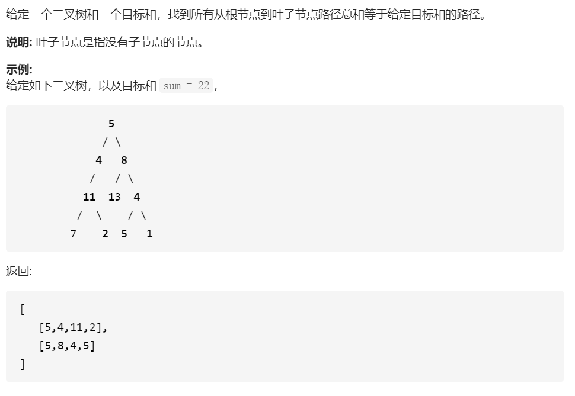

```python
# Definition for a binary tree node.
# class TreeNode(object):
#     def __init__(self, x):
#         self.val = x
#         self.left = None
#         self.right = None

class Solution(object):
    def pathSum(self, root, sum):
        """
        :type root: TreeNode
        :type sum: int
        :rtype: List[List[int]]
        """
        res = []
        path = []
        def dfs(node, tar):
            if not node:
                return 
            
            tar -= node.val
            path.append(node.val)

            if tar == 0 and not node.left and not node.right:
                res.append(path[:])
                
       
            dfs(node.left, tar)
            dfs(node.right, tar)
            path.pop()

        dfs(root, sum)

        return res
```

### Tips

* 先序遍历二叉树，回溯搜索


## 剑指22.链表中倒数第k个节点

## 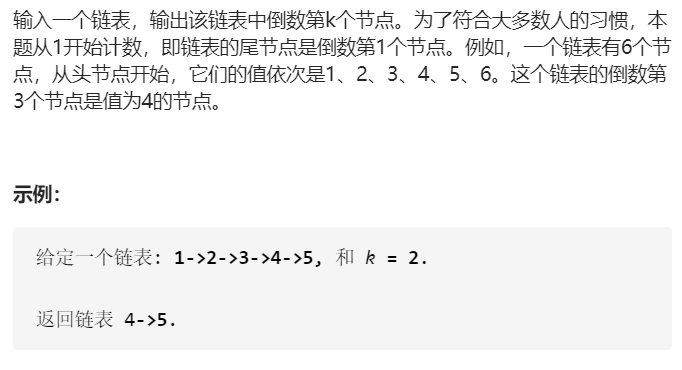

```python
# Definition for singly-linked list.
# class ListNode(object):
#     def __init__(self, x):
#         self.val = x
#         self.next = None

class Solution(object):
    def getKthFromEnd(self, head, k):
        """
        :type head: ListNode
        :type k: int
        :rtype: ListNode
        """
        p = head
        count = 1
        while head.next:
            head = head.next
            count += 1
        
        print(count)

        p_count = count - k

        while p_count > 0:
            p = p.next
            p_count -= 1

        return p
```

### Tips

* 也可以使用双指针
* 第一个指针先走k步


## 剑指51.数组中的逆序对

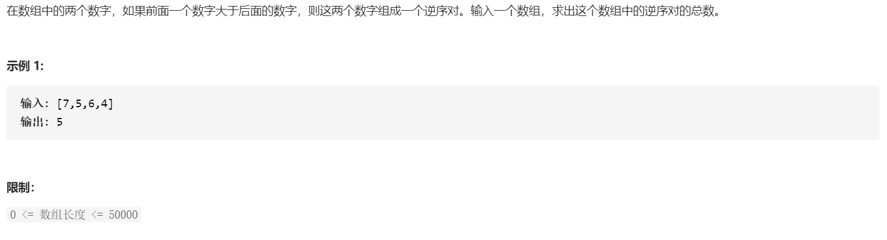

```python
class Solution(object):
    def reversePairs(self, nums):
        """
        :type nums: List[int]
        :rtype: int
        """
        
        global count
        count = 0
        def merge(left, right):

            res = []    
            i = 0
            j = 0

            while i < len(left) and j < len(right):
                if left[i] <= right[j]:
                    res.append(left[i])
                    global count
                    count += j
                    i += 1

                else:
                    res.append(right[j])
                    j += 1

            if i == len(left):
                res += right[j:]

            if j == len(right):
                res += left[i:]
                count += j * (len(left) - i)

            return res
            


        def mergeSort(nums):
            count = 0
            if len(nums) <= 1:
                return nums
            
            n = len(nums)
            left = mergeSort(nums[: n // 2])
            right = mergeSort(nums[n // 2 :])

            return merge(left, right)

        res = mergeSort(nums)

        return count
```

### TIPS

* 逆序对的计数，是归并排序的时候，合并时的副产物

* 当归并排序的时候，只要左边指针移动，就加上此时右边指针的索引
* 所以当右边指针到末位的时候，每从左边pop一个数字，就要加上个`len(right)`


## 1143.最长公共子序列

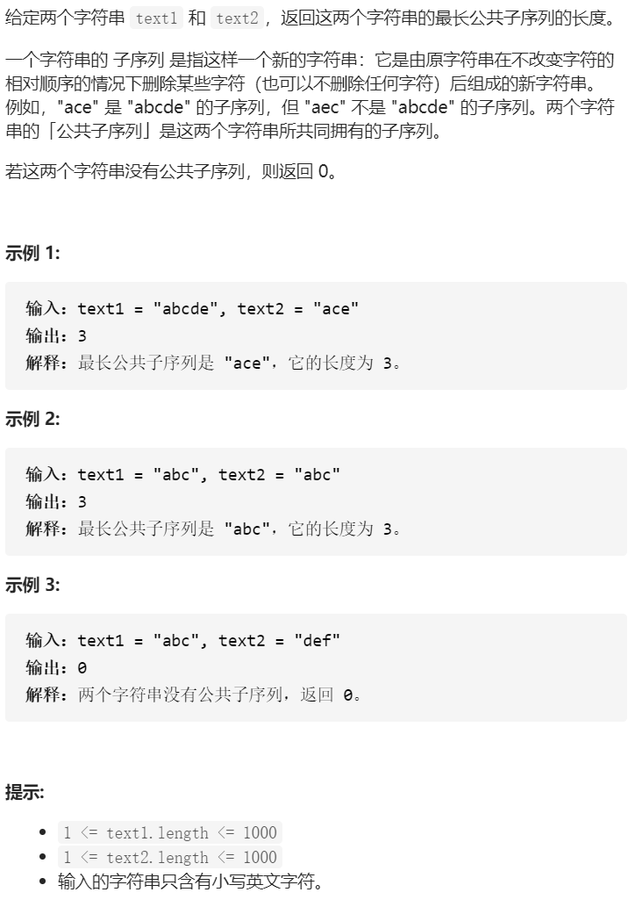

```python
class Solution(object):
    def longestCommonSubsequence(self, text1, text2):
        """
        :type text1: str
        :type text2: str
        :rtype: int
        """
        m = len(text1)
        n = len(text2)

        dp = [[0 for _ in range(n + 1)] for _ in range(m + 1)]

        # 最长公共子序列
        res = []
        for i in range(1, m + 1):
            for j in range(1, n + 1):
                if text1[i - 1] == text2[j - 1]:
                    res.append(text1[i - 1])
                    dp[i][j] = dp[i - 1][j - 1] + 1
                else:
                    dp[i][j] = max(dp[i - 1][j], dp[i][j - 1])

        print(res)
        return dp[-1][-1]

```

### Tips

* `dp[i][j]`是指`str1[:i]`与`str2[:j]的最长公共子序列长度`
* `dp[0][:]`和`dp[:][0]`初始化为0

* 注意转移方程

```python
### 递归
class Solution(object):
    def longestCommonSubsequence(self, text1, text2):
        """
        :type text1: str
        :type text2: str
        :rtype: int
        """
        global res
        res = []
        def dp(i, j):
            if i == -1 or j == -1:
                return 0
            if text1[i] == text2[j]:
                global res
                res.append(text1[i])
                return dp(i - 1, j - 1) + 1
            else:
                return max(dp(i, j - 1), dp(i - 1, j))
        
        count = dp(len(text1) - 1, len(text2) - 1) 
        print(res)
        return count
```


### 最长公共子串

```python
### 最长公共子串

def LCS(text1, text2):
    res = 0
    
    dp = [[0 for _ in range(len(text1))] for _ in range(len(text2))]
    
    for i in range(1, len(text2) + 1):
        for j in range(1, len(text1) + 1):
            if text1[j] == text2[i]:
                dp[i][j] = dp[i - 1][j - 1] + 1
                res = max(res, dp[i][j])
                
    return res
    
```

### Tips

* 注意和最长公共子序列的dp不一样`

* `dp[i][j]`是指`A[i]`和`B[j]`结尾的公共子串的长度

  

## 3.无重复字符的最长子串

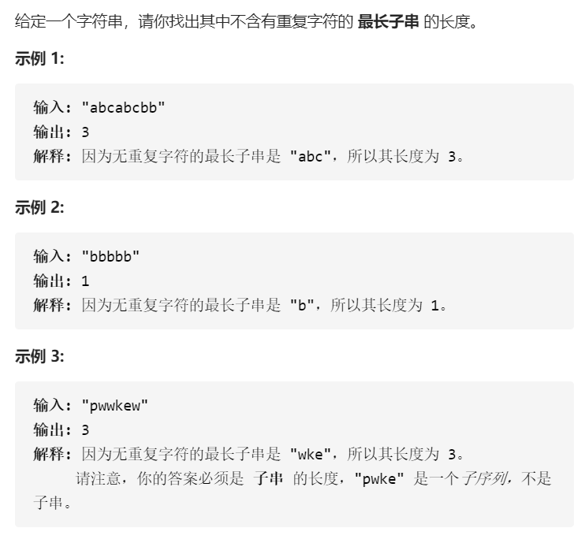

```python
class Solution(object):
    def lengthOfLongestSubstring(self, s):
        """
        :type s: str
        :rtype: int
        """
        record = []
        max_length = 0
        for c in s:
            if c not in record:
                record.append(c)
                max_length = max(max_length, len(record))
            else:
                record = record[record.index(c) + 1 : ]
                record.append(c)
        
        return max_length
```

### Tips

* 一次遍历列表，使用一个动态数组存储没见过的新单词
* 如果见过，就讲动态数组给截取掉头部
* 同时维护一个变量记录数组出现过的最大值


## 452.用最少数量的箭引爆气球

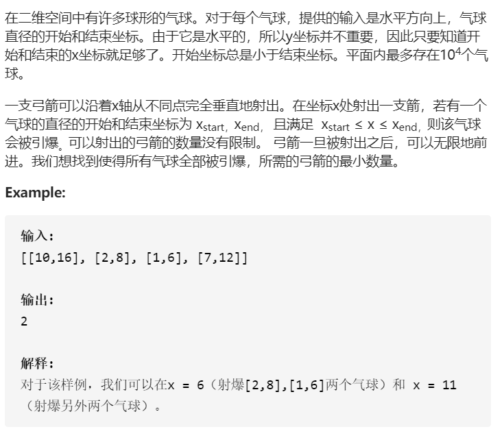

```python
class Solution(object):
    def findMinArrowShots(self, points):
        """
        :type points: List[List[int]]
        :rtype: int
        """
        if not points:
            return 0
        # 首先将数组按第二个元素大小升序排序
        def quick(left, right):
            if left >= right:
                return
            
            pivot = left

            i = left
            j = right

            while i < j:
                while i < j and points[j][1] > points[pivot][1]:
                    j -= 1
                while i < j and points[i][1] <= points[pivot][1]:
                    i += 1                
                points[i], points[j] = points[j], points[i]
            points[j], points[pivot] = points[pivot], points[j]

            quick(left, j - 1)
            quick(j + 1, right)

        quick(0, len(points) - 1)

        count = 1
        
        bound = points[0][1]

        for balloon in points:
            # 如果气球的头超过了尾
            if balloon[0] > bound:
                bound = balloon[1]
                count += 1
            
        return count
```

### Tips

* 首先按照尾巴坐标，升序排列
* 那最节省的箭一定是从前一个气球的尾巴发出的


## 面试题17.24. 最大子矩阵

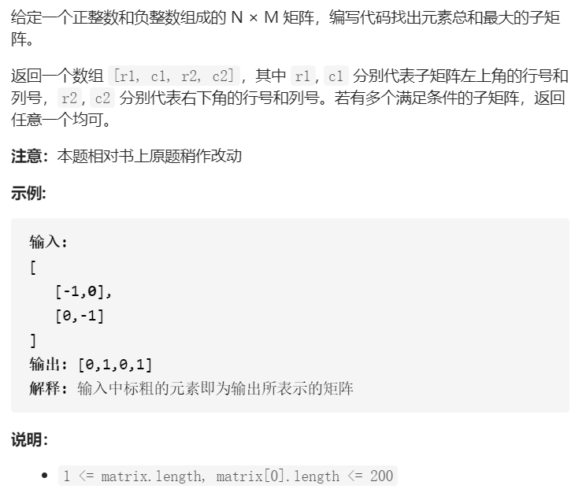

```python
class Solution(object):
    def getMaxMatrix(self, matrix):
        """
        :type matrix: List[List[int]]
        :rtype: List[int]
        """

        h = len(matrix)
        w = len(matrix[0])


        res = [0, 0, 0, 0]
        max_sum = matrix[0][0]
        
        # 遍历以i为上界，j为下界
        for i in range(h):
            # 每次更换上标的时候重置b
            b = [0 for _ in range(w)]
            for j in range(i, h):
                # 让后将b加上当前j行，这里的循环可以和下面的动态规划搜索进行合并，少一个循环
                b = [b[c] + matrix[j][c] for c in range(w)]
                # 然后对b进行最大子序列搜索
                pre_sum = 0
                tmp_start = 0
                for c in range(w):
                        if pre_sum < 0:
                            # 另起炉灶
                            pre_sum = b[c]
                            tmp_start = c
                        else:
                            pre_sum += b[c]                          
                        
                        if pre_sum > max_sum:
                            max_sum = pre_sum
                            # 更新坐标
                            res[0] = i
                            res[1] = tmp_start
                            res[2] = j
                            res[3] = c               
                
        return res
```

### Tips

* 同leetcode53“最大子序列和”
* 纵向遍历以i行为上界，j行为下界的子矩阵和，然后进行横向动态规划搜索
* 只是注意每次以j为下界的子矩阵和没必要重头开始求和，将上一次的b加上j行即可。


## 64. 最小路径和

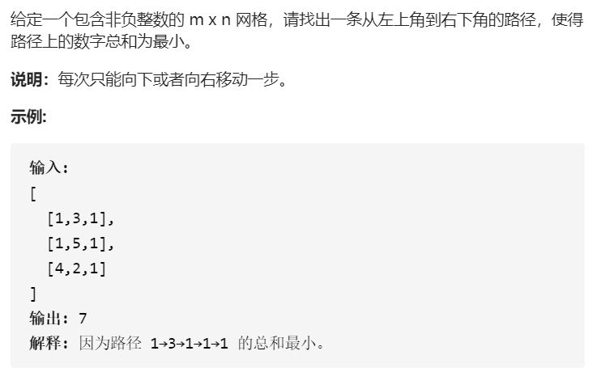

```python
class Solution(object):
    def minPathSum(self, grid):
        """
        :type grid: List[List[int]]
        :rtype: int
        """

        dp = [0 for _ in range(len(grid[0]))]

        sum = 0
        for i in range(len(grid[0])):
            sum += grid[0][i]
            dp[i] = sum


        for i in range(1, len(grid)):
            dp[0] += grid[i][0]
            for j in range(1, len(grid[0])):
                dp[j] = min(dp[j - 1], dp[j]) + grid[i][j]

        return dp[-1]
```

### Tips

* 用递归可能超时
* 动态规划`dp[i][j] = min(dp[i - 1][j], dp[j][i - 1]) + grid[i][j]`


## 670.最大交换

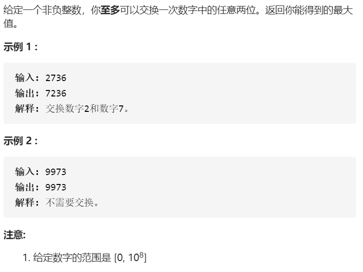

```python
class Solution(object):
    def maximumSwap(self, num):
        """
        :type num: int
        :rtype: int
        """
        
        nums = list(str(num))

        record = collections.defaultdict(int)

        for i, number in enumerate(nums):
            record[number] = i

        print(record)
        for i in range(len(nums)):
            for digital in range(9, int(nums[i]), -1):           
                if record[str(digital)] > i:
                    index = record[str(digital)]
                    nums[i], nums[index] = nums[index], nums[i]                  
                    count = 0
                    res = 0
                    for c in nums[::-1]:
                        res += int(c) * (10 ** count)
                        count += 1
                    return res

        return num
```

### Tips

* 使用哈希表存储0 ~ 9 数字在数组中最后出现位置的索引
* 从左到右遍历数组，从高往低遍历9 ~ 0，遇到第一个大于`nums[i]`的数，且他的索引也大于i，就进行交换


## 判断两线段是否相交

```python
# 判断(ax1, ay1) (ax2, ay2)和(bx1, by1) (bx2, by2)是否相交

def Crossornot():
    
    vec_a = (ax2 - ax1, ay2 - ay1)
    vec_b = (bx2 - bx1, by2 - by1)
    
    # 如果两向量不平行
    if vec_a[0] * vec_b[1] - vec_a[1] * vec_b[0] != 0:
        vec1 = (bx2 - ax1, by2 - ay1)
        vec2 = (bx1 - ax1, by1 - ay1)
        vec3 = (ax1 - bx1, ay1 - by1)
        vec4 = (ax2 - bx1, ay2 - by1)
        
        vec1_vecb = vec1[0] * vec_b[1] - vec1[1] * vec_b[0]
        vec2_vecb = vec2[0] * vec_b[1] - vec2[1] * vec_b[0]
        
        vec3_veca = vec3[0] * vec_a[1] - vec3[1] * vec_a[0]
        vec4_veca = vec4[0] * vec_a[1] - vec4[1] * vec_a[0]
        
        if vec1_vecb * vec2_vecb <= 0 and vec3_veca * vec4_veca <= 0:
            # 如果v1vb和v2vb异号，v3va和v4va异号
            return True
    else:
        if a头b尾与a,b共线 并且 a尾大于b头:
            return True
        
    return False
        
    
    
```

### Tips

* 双双捉对向量叉乘，判断是否同号


## 647.回文子串

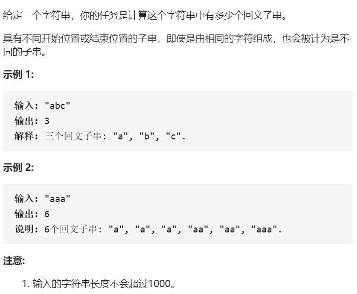

```python
class Solution(object):
    def countSubstrings(self, s):
        """
        :type s: str
        :rtype: int
        """

        n = len(s)
        res = 0
        for center in range(n * 2 - 1):
            left = center // 2
            right = left + center % 2
            while left >= 0 and right < n and s[left] == s[right]:
                res += 1
                left -= 1
                right += 1
        return res
```

### Tips

* 遍历所有可能是回文中心的位置，从中心位置往左右两边搜索

* 或者用动态规划 当 `s[i] == s[j] && (j - i < 2 || dp[i + 1][j - 1])`
* `dp[i][j]` 表示字符串`s`在`[i,j]`区间的子串是否是一个回文串
* 从二维dp右下角开始往上遍历


## 面试题04.02. 最小高度树

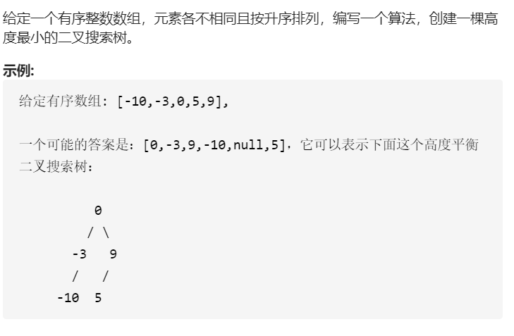

```python
# Definition for a binary tree node.
# class TreeNode(object):
#     def __init__(self, x):
#         self.val = x
#         self.left = None
#         self.right = None

class Solution(object):
    def sortedArrayToBST(self, nums):
        """
        :type nums: List[int]
        :rtype: TreeNode
        """

        if not nums:
            return None
        
        n = len(nums)
        mid = n // 2

        root = TreeNode(nums[mid])
        root.left = self.sortedArrayToBST(nums[:mid])
        root.right = self.sortedArrayToBST(nums[mid + 1:])

        return root
```


## 903.DI序列的有效排列

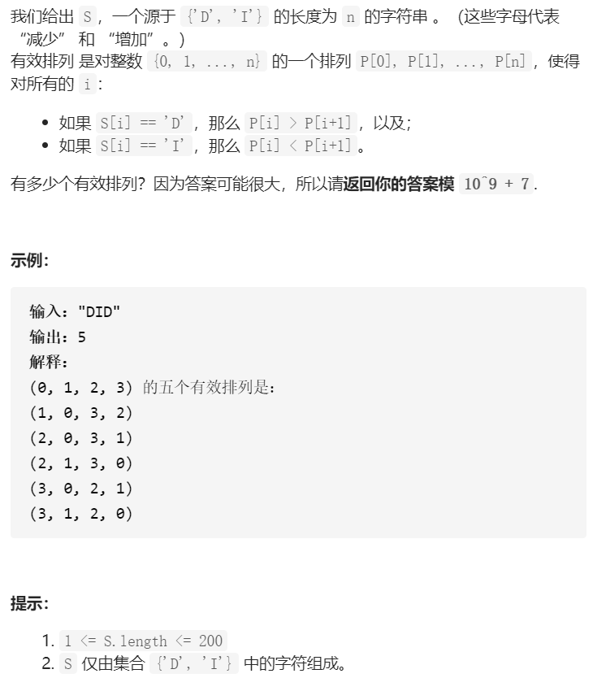

```python
class Solution(object):
    def numPermsDISequence(self, S):
        """
        :type S: str
        :rtype: int
        """
        mod = 10 ** 9 + 7
        n = len(S)
        # 初始化二维dp数组(n + 1, n + 1)

        dp = [[0 for _ in range(n + 1)] for _ in range(n + 1)]
        dp[0][0] = 1

        for i in range(1, n + 1):
            if S[i - 1] == 'I':
                # 如果是I, 遍历[1, i]，因为索引0一定为0
                for j in range(1, i + 1):
                    dp[i][j] = dp[i][j - 1] + dp[i - 1][j - 1]
            
            else:
                # 如果是D，最好从右往左遍历
                # 遍历[i - 1, 0], 因为序列最后一位不能选择i，所以dp[i][i]一定为0
                for j in range(0, i)[::-1]:
                    dp[i][j] = dp[i][j + 1] + dp[i - 1][j]

        return sum(dp[-1])%mod
```

### Tips

* 二维动态规划，`dp[i][j]`意义为长度为`i + 1`的合法序列，最后一位为`j`的合法排列数
* 所以我们将`dp[i]`行求和，就是我们最终的答案

* 假设没有添加最后一位的时候，排列为A，如果此时是`I`升序，不考虑前面的选择，则理论上最后一位可以选择的数为`[1, i]`，一共i - 1种可能性，那每种可能性有多少种排列呢？比如我们想在A的后面添加一个j，则只要`A[-1] < j`的排列，都是可以操作的。（只需将A中大于等于`j`的数增加1就可以成为合法序列，相当于一直置换），所以要计算以j结尾的数字的排列数，只需要计算满足A[-1] < j的排列数即可，即`dp[i][j] = dp[i - 1][0] + ... + dp[i - 1][j - 1]`，简化后即为`dp[i][j] = dp[i][j - 1] + dp[i - 1][j - 1]`
* 如果此时是`D`降序，不考虑前面的选择，则理论上最后一位可以选择的数为`[0, i - 1]`，一共`i - 1`种可能性，那每种可能性有多少种排列呢？比如我们想在A的后面添加一个j，则只要`A[-1] >= j`的排列，都是可以操作的。（只需将A中大于等于`j`的数增加1就可以成为合法序列，相当于一直置换），所以要计算以`j`结尾的数字的排列数，只需要计算满足`A[-1] >= j`的排列数即可，即`dp[i][j] = dp[i - 1][j] + ... + dp[i - 1][i - 1]`，简化后即为`dp[i][j] = dp[i][j + 1] + dp[i - 1][j]`，所以这层最好从右往左遍历。

|       | 0    | 1    | 2    | 3    | 4    |
| ----- | ---- | ---- | ---- | ---- | ---- |
| START | 1    |      |      |      |      |
| D     | 1    | 0    |      |      |      |
| I     | 0    | 1    | 1    |      |      |
| D     | 2    | 2    | 1    | 0    |      |
| D     | 5    | 3    | 1    | 0    | 0    |


## 判断多边形是否相交

```python
def HowManyCross(pointA,lineA):
	# 返回过点A的水平正向射线与线段交点数量，0或1
    
    if  y2 == y1:
        # 两直线平行或重合，没有交点或无限个交点
        return 0
    else:
        # 直线两点式 (x - x1) / (x2 - x1) = (y - y1) / (y2 - y1)
        # 与射线y = yA (x > xA)的交点
        x = (yA - y1)(x2 - x1)/(y2 - y1) + x1
        
        if x >= xA and (min(x1, x2) <= x <= max(x1, x2)):
            # 若交点在过点A的正向射线上，并且交点在线段两端点之间
            return 1
        
def isCrossorNot(polyA, polyB):
    # 判断多边形是否相交
    # 遍历A的每个端点
    for point in polyA:
        count = 0
        # 遍历B的每条边
        for line in polyB:
            # 统计过每个端点的正向射线与边的交点总和
            count += HowmanyCross(point, line)
            if count%2 == 1:
                # 只要某一个端点的统计和为奇数，则点A一定在B内部
                return True
            
     # 同样遍历B的每个端点，遍历A的每条边
    
    # 否则
    return False
```


## 足球出线问题

m支球队，n个出线权

最低出线分数 m - n （想象有m - n + 1支弱队互相打平，且他们都输给强队）


最高未出线分数(想象有n + 1支强队，他们都胜了弱队，互相厮杀

若n为偶数，那他们都n / 2胜, n/2输，积`3 * (m - n - 1) + 3 * n / 2`分，胜弱队的分加上)

若n为奇数，则他们中一定有个超级强队，超然度外，剩余的他们n - 1/2胜，n - 1 / 2输，积`3 * (m - n - 1) + 3 * (n - 1) / 2`


## 不等概率生成器

给定一个不等概率生成器，随机生成 0 和1 的概率分别为 p 和1-p， p 不等于0.5，要求设计如下等概率生成器：

（1） 随机生成0 和1 的概率为0.5

| 00    | 01         | 10         | 11            |
| ----- | ---------- | ---------- | ------------- |
| p * p | p * (1- p) | p * (1- p) | (1- p)(1 - p) |


连续ROLL两次，可以发现，01和10出现的概率相等，都是(1-p)*p 。所以如果连续两次ROLL，出现01，则生成0； 如果出现10，认为出现1，出现其他重新掷即可实现生成0和1等概率0.5

（2）随机生成0，1 和2 的概率为1/3

连续掷三次出现001，010，100三种等概率，都是1/3

（3） 随机生成0，1，2，…n-1 的概率为1/n

连续掷n次 出现0000...001对应0， 出现0000...010对应1， ... ... ... 出现1000...000对应n


## 643. 子数组最大平均数

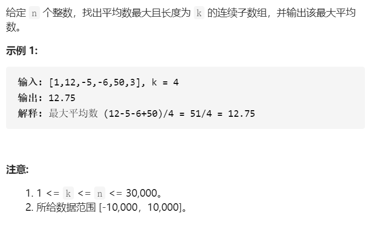

```python
# 这里的代码输出的是长度大于等于k的最大连续子数组
def LargestAverage(nums, k):
    n = len(nums)
    #建立滚动和数组，第i个元素为数组nums前i + 1个元素之和
    sums = [0 for _ in range(n)]
    sums[0] = nums[0]
    for i in range(1, n):
    	sums[i] = sums[i] + nums[i]
 
 	max_avg = 0
 	# 遍历所有可能的k 
 	for t in range(k, n + 1):
    # 初始值设为连续数组的起点为索引为0的元素
    	max_sum = sums[t - 1]
    # 遍历连续数组所有可能的起点，
    for i in range(t, n):
        max_sum = max(max_sum, sums[i] - sums[i - t])
    avg = max_sum / t
    max_avg = max(max_avg, avg)

  return max_avg

```

### Tips

* 建立滚动和数组
* 遍历所有可能的K


## 根据四个点坐标判断是否是矩形

### Tips

* 判断中心到四点的距离是否相等


## 240. 搜索二维矩阵II

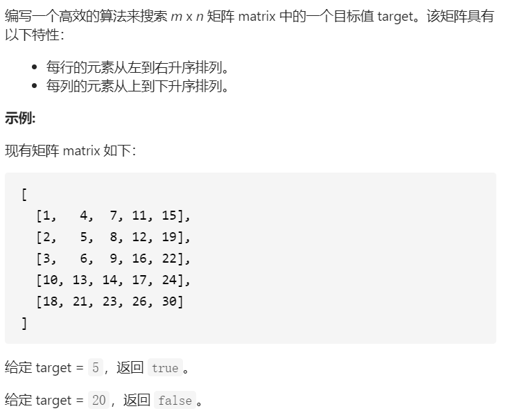

```python
class Solution(object):
    def searchMatrix(self, matrix, target):
        """
        :type matrix: List[List[int]]
        :type target: int
        :rtype: bool
        """

        if not matrix:
            return False

        h = len(matrix)
        w = len(matrix[0])

        i = h - 1
        j = 0

        while i >= 0 and j <= w - 1:
            if matrix[i][j] == target:
                return True
            
            if matrix[i][j] > target:
                i -= 1

            if matrix[i][j] < target:
                j += 1

        return False
```

### Tips

* 从左下角开始搜索

