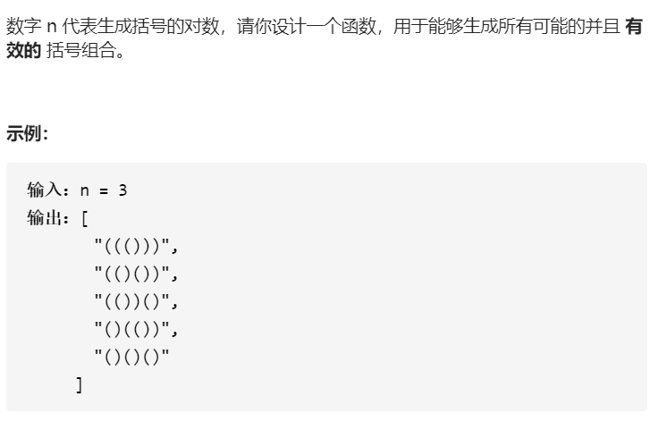
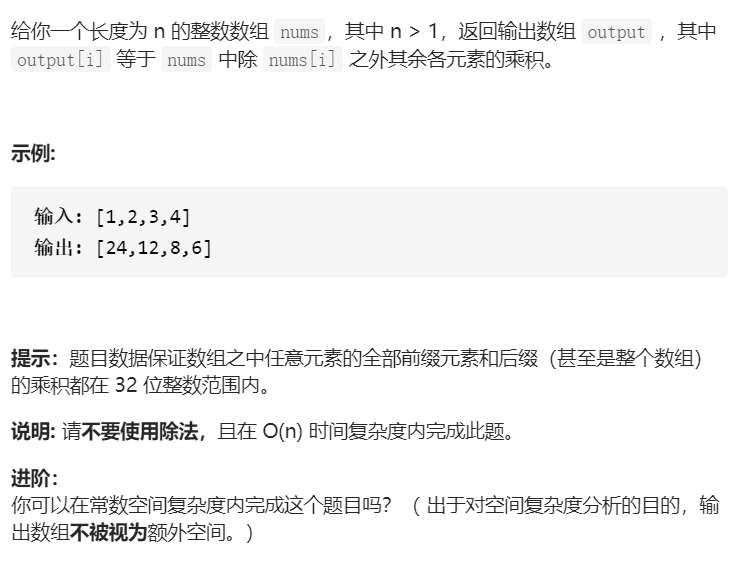

## 78.子集


```python
# 78.子集
# 递归
class Solution(object):
    def subsets(self, nums):
        """
        :type nums: List[int]
        :rtype: List[List[int]]
        """
        
        if not nums:
            return [[]]

        res1 = self.subsets(nums[:-1])
        res2 = [[nums[-1]]]
        res3 = [element + [nums[-1]] for element in res1[1:]]

        return res1 + res2 + res3
```


### Tips

* 使用递归
* 也可以迭代，`f(n) = f(n - 1) + [i.append(n) for i in f(n - 1)]`
* 也可以使用回溯


## 46.全排列


```python
# 46.全排类
# 递归
class Solution(object):
    def permute(self, nums):
        """
        :type nums: List[int]
        :rtype: List[List[int]]
        """
        if len(nums) == 1:
            return [[nums[-1]]]
        
        res = []
        last = self.permute(nums[:-1])
        for i in last:
            for j in range(len(nums[:-1]) + 1):
                ans = i[:j] + [nums[-1]] + i[j:]
                res.append(ans)

        return res
```

### Tips

* 使用简单递归

```python
# 46.全排列
# 回溯递归，使用额外的数组记录数字是否使用
class Solution(object):
    def permute(self, nums):
        """
        :type nums: List[int]
        :rtype: List[List[int]]
        """
        def dfs(length, nums, depth, used, path, res):
            # 当当前深度达到最大深度的时候，停止递归
            if depth == length:
                res.append(path[:])
                return 

            for i in range(length):
                if not used[i]:
                    path.append(nums[i])
                    used[i] = True
                    # 继续下一层的选择
                    dfs(length, nums, depth + 1, used, path, res)
                    # 回溯，回退，回滚!
                    used[i] = False
                    path.pop()


        length = len(nums)
        used = [False] * length
        res = []

        if not nums:
            return []

        dfs(length, nums, 0, used, [], res)

        return res
```

### Tips

* 回溯递归需要维护三个变量： **当前操作深度`depth`，可以选择的元素列表`used`，排列的缓存`path`**
* 回溯的意思即是到了底部，需要回滚上一次操作，重新选择，所以多配合递归写法
* python中注意`path`变量，如果要对其进行复制，需要`path[:]`


```python
# 46.全排列
# 回溯递归，使用交换的方法记录数字是否使用
class Solution(object):
    def permute(self, nums):
        """
        :type nums: List[int]
        :rtype: List[List[int]]
        """
        def dfs(first_not_used):
            if first_not_used == length:
                res.append(nums[:])
                return 

            for i in range(first_not_used, length):
                # 动态维护原始数组，将使用过的数字放前，没使用的数字在后
                nums[first_not_used], nums[i] = nums[i], nums[first_not_used]
                # 第一位没使用的数字的索引加1
                dfs(first_not_used + 1)
                # 回溯，回退
                nums[first_not_used], nums[i] = nums[i], nums[first_not_used]
            
        res = []
        length = len(nums)
        dfs(0)

        return res
```

### Tips:

* 使用交换的方法可以使代码更加简洁
* 将已经选择过的数字放在前面，没有使用过的数字放在后面

## 22.括号生成



```python
# 22.括号生成
# 按照长度的递归，动态规划的思想
class Solution(object):
    def generateParenthesis(self, n):
        """
        :type n: int
        :rtype: List[str]
        """
        if not n:
            return ['']
        ans = []
        for c in range(n):
            for left_comb in self.generateParenthesis(c):
                for right_comb in self.generateParenthesis(n-c-1):
                    ans.append('({}){}'.format(left_comb, right_comb))

        return ans

            
```

### Tips

* 任何长度为`2 * n`的合法组合都可以归纳为`(left)right`
* 遍历left和right的合法组合


```python
# 22.括号生成
# 回溯
class Solution(object):
    def generateParenthesis(self, n):
        """
        :type n: int
        :rtype: List[str]
        """
        
        def dfs(n, depth, l_used, r_used, path, res):
            if depth == 2 * n:
                res.append(path)
                return 

            if l_used < n:
                path += '('
                dfs(n, depth + 1, l_used + 1, r_used, path, res)
                path = path[:-1]

            if r_used < l_used:
                path += ')'
                dfs(n, depth + 1, l_used, r_used + 1, path, res)
                path = path[:-1]

        res = []
        dfs(n, 0, 0, 0, '', res)

        return res
```

### Tips

* 使用回溯，当右边括号小于左边括号数量的时候可以选择右边括号，当左边括号小于n的时候可以选择左边括号
* 注意这里面没有循环语句，那是因为每到一个节点，最多只有两种选择


## 289.生命游戏


```python
class Solution(object):
    def gameOfLife(self, board):
        """
        :type board: List[List[int]]
        :rtype: None Do not return anything, modify board in-place instead.
        """

        row = len(board)
        column = len(board[0])

        for i in board:
            i.append(0)
            i.insert(0, 0)
        
        board.append([0] * (column + 2))
        board.insert(0, [0] * (column + 2))

        loop = [(-1 ,-1), (-1, 0), (-1, 1), (0, -1), (0, 1), (1, -1), (1, 0), (1, 1)]
        
        # 先遍历一次活细胞，让活的该死的死，活得变死的标-1
        for i in range(1, row + 1):
            for j in range(1, column + 1):
                if board[i][j] == 1:
                    sum = 0 
                    for m, n in loop:
                        # 取绝对值，这样不管某个周围活细胞下一步死没死，这一步都算活
                        sum += abs(board[i + m][j + n])
                    if sum < 2 or sum > 3:
                        board[i][j] = -1
        # 再次遍历死细胞，让死的该活的活，死的变活的标1
        for i in range(1, row + 1):
            for j in range(1, column + 1):
                if board[i][j] == 0:
                    sum = 0 
                    for m, n in loop:
                        # 不是这一次复活的
                        if board[i + m][j + n] != 2:
                        # 取绝对值，这样不管某个周围活细胞下一步死没死，这一步都算活
                            sum += abs(board[i + m][j + n])                 
                    if sum == 3:
                        board[i][j] = 2

        # 最后一次遍历所有细胞，让-1的标0
        for i in range(1, row + 1):
            for j in range(1, column + 1):
                if board[i][j] < 0:
                    board[i][j] = 0
                if board[i][j] > 0:
                    board[i][j] = 1

        board.pop(0)
        board.pop(-1)

        for i in board:
            i.pop(0)
            i.pop(-1)
```

### Tips

* 可以先将数组pad,方便处理边界元素
* 如果原地改变数组，则需要使用额外状态标注生死的转换
* 先活的变死，再死的变活


## 94.二叉树的中序遍历


```python
# Definition for a binary tree node.
# class TreeNode(object):
#     def __init__(self, x):
#         self.val = x
#         self.left = None
#         self.right = None

class Solution(object):
    def inorderTraversal(self, root):
        """
        :type root: TreeNode
        :rtype: List[int]
        """

        res = []
        stack = []
        p = root

        while p or stack:
            while p:
                stack.append(p)
                p = p.left
            p = stack.pop()
            res.append(p.val)
            p = p.right

        return res
```

### Tips

* 一直往左走，顺序入栈，左到底，出个栈，往右走，再左到底
* [二叉树的所有遍历](https://leetcodebianli-cn.com/problems/binary-tree-inorder-traversal/solution/python3-er-cha-shu-suo-you-bian-li-mo-ban-ji-zhi-s/)


## 230.二叉搜索树中的第k小的元素


```python
# Definition for a binary tree node.
# class TreeNode(object):
#     def __init__(self, val=0, left=None, right=None):
#         self.val = val
#         self.left = left
#         self.right = right

class Solution(object):
    def kthSmallest(self, root, k):
        """
        :type root: TreeNode
        :type k: int
        :rtype: int
        """

        stack = []
        p = root

        while stack or p:
            while p:
                stack.append(p)
                p = p.left
            p = stack.pop()
            k -= 1
            if not k:
                return p.val
            p = p.right
        

```

### Tips

* 相当于对二叉搜索树进行中序遍历，然后返回第k个元素


## 238.除自身以外的数组的乘积




```python
def productExceptSelf(nums):
    """
    :type nums: List[int]
    :rtype: List[int]
    """

    n = len(nums)
    res = [1] * n

    p = 1
    q = 1

    for i in range(1, n):
        p *= nums[i - 1]
        res[i] = p

    for i in range(n - 2, -1, -1):
        q *= nums[i + 1]
        res[i] *= q

    return res
```

### Tips

* 注意两个循环的起始和终止索引

* 使用乘积矩阵，分别计算上三角，下三角，额外空间为**O(1)**
* 时间为**O(n)**


## 48.旋转图像


```python
# 48.旋转图像

class Solution(object):
    def rotate(self, matrix):
        """
        :type matrix: List[List[int]]
        :rtype: None Do not return anything, modify matrix in-place instead.
        """

        length = len(matrix[0])

        # 先进行转置

        for i in range(length - 1):
            for j in range(i + 1, length):
                matrix[i][j], matrix[j][i] = matrix[j][i], matrix[i][j]

        # 再进行水平镜像
        for row in matrix:
            for i in range(length // 2):
                row[i], row[- i - 1] = row[- i - 1], row[i]
```

### Tips

* 先进行一次转置，再进行一次水平镜像


## 131.分割回文串


```python
class Solution(object):
    def partition(self, s):
        """
        :type s: str
        :rtype: List[List[str]]
        """
        def isPana(s):
            return s == s[::-1]

        length = len(s)

        if length == 1:
            return [[s]]
        
        if not s:
            return [[]]

        res = []
        for i in range(1, length + 1):
            left = s[:i]
            right = s[i:]

            if isPana(left):
                ans = self.partition(right)
                for line in ans:
                    res += [[left] + line]
        return res
```

### Tips

* 动态规划的思想
* 使用递归
* 依次划分字符串，判断左边是否回文，再加上右边部分的递归

```python
# 131.分割回文串
# 回溯

class Solution(object):
    def partition(self, s):
        """
        :type s: str
        :rtype: List[List[str]]
        """
        
        def isPana(s):
            return s == s[::-1]

        def dfs(s, start, path, res):
            # 终止条件，当切割指针指向最后一位的时候，终止
            if start == len(s):
                # 注意需要添加path的复制
                res.append(path[:])
                return 
			
            # 遍历此时可能的截取长度
            for i in range(start, len(s)):
                # 只要某截取长度是回文
                if isPana(s[start:i + 1]):
                    # 则将此段加入path
                    path.append(s[start : i + 1])
                    # 从i + 1位开始继续搜索
                    dfs(s, i + 1, path, res)
                    # 回溯
                    path.pop()
                    
                    
        res = []
        dfs(s, 0, [], res)

        return res
```

### Tips

* 回溯法需要维护**目前深度**，**目前途径**，以及**可供选择的分叉**

## 208.实现前缀树


```python
class Trie(object):

    def __init__(self):
        """
        Initialize your data structure here.
        """
        # 使用字典
        self.lookup = {}


    def insert(self, word):
        """
        Inserts a word into the trie.
        :type word: str
        :rtype: None
        """
        
        # 在单词末尾增加标识以代表单词完成
        word_t = word + '#'

        if word_t[0] == '#':
            self.lookup['#'] = True
            return

        elif word_t[0] in self.lookup:
            self.lookup[word_t[0]].insert(word[1:])
        else:
            self.lookup[word_t[0]] = Trie()
            self.lookup[word_t[0]].insert(word[1:])
            

    def search(self, word):
        """
        Returns if the word is in the trie.
        :type word: str
        :rtype: bool
        """
        word_t = word + '#'

        if word_t[0] == '#' and word_t[0] in self.lookup:
            return True
        if word_t[0] not in self.lookup:
            return False
        else:
            return self.lookup[word_t[0]].search(word_t[1:])


    def startsWith(self, prefix):
        """
        Returns if there is any word in the trie that starts with the given prefix.
        :type prefix: str
        :rtype: bool
        """

        if not prefix:
            return True
        
        if prefix[0] in self.lookup:
            return self.lookup[prefix[0]].startsWith(prefix[1:])
        
        else:
            return False
```

### Tips:

* 使用递归的方式完成几个方法的搭建
* 注意插入和查找的时候都需要对输入进行特殊处理，在待处理的单词末尾加上一个特殊符号代表结束


## 105.从前序与中序遍历序列构建二叉树


```python
# 105.从前序与中序构建二叉树
# 递归
# Definition for a binary tree node.
# class TreeNode(object):
#     def __init__(self, x):
#         self.val = x
#         self.left = None
#         self.right = None

class Solution(object):
    def buildTree(self, preorder, inorder):
        """
        :type preorder: List[int]
        :type inorder: List[int]
        :rtype: TreeNode
        """

        if not preorder:
            return None
        
        if len(preorder) == 1:
            return TreeNode(preorder[0])

        root = TreeNode(preorder[0])
        index = inorder.index(root.val)

        left_inorder = inorder[:index]
        right_inorder = inorder[index + 1:]

        left_length = len(left_inorder)
        right_length = len(right_inorder)

        left_preorder = preorder[1 : left_length + 1]
        right_preorder = preorder[left_length + 1 :]

        root.left = self.buildTree(left_preorder, left_inorder)
        root.right = self.buildTree(right_preorder, right_inorder)

        return root
        
```

### Tips

* 对于任何二叉树，他们的排列都是

* `[ 根节点, [左子树的前序遍历结果], [右子树的前序遍历结果] ]`
* `[ [左子树的中序遍历结果], 根节点, [右子树的中序遍历结果] ]`

* 首先定位根节点，分出左右树，然后递归

* 还可以使用迭代，逻辑比较复杂


## 148.排序链表


```python
# Definition for singly-linked list.
# class ListNode(object):
#     def __init__(self, x):
#         self.val = x
#         self.next = None

class Solution(object):
    def sortList(self, head):
        """
        :type head: ListNode
        :rtype: ListNode
        """

        if not head or not head.next:
            return head

        slow = head
        fast = head

        while fast.next and fast.next.next:
            fast = fast.next.next
            slow = slow.next
        
        # 此时满指针位于奇数长度的中点，或者偶数长度的中间左边
        mid = slow.next
        slow.next = None
        
        left = self.sortList(head)
        right = self.sortList(mid)

        return self.mergeList(left, right)
        
    
    def mergeList(self, left, right):
        # 开始归并
        res = ListNode(0)
        h = res
        while left and right:
            if left.val <= right.val:
                h.next = left
                left = left.next
            else:
                h.next = right
                right = right.next
            h = h.next
        h.next = left if left else right

        return res.next
```

### Tips

* 使用归并排序，这样时间和空间复杂度都能满足要求
* 先使用快慢指针，递归将链表一分为二
* 到达递归底部时，开始归并，将两个排序好的链表合二为一

* 可以使用递归，也可以使用迭代，迭代的逻辑较为复杂

  

## 287.寻找重复数


```python
#287.寻找重复数
# 快慢指针
class Solution(object):
    def findDuplicate(self, nums):
        """
        :type nums: List[int]
        :rtype: int
        """
        # 快慢指针
        slow = nums[0]
        fast = nums[nums[0]]

        while slow != fast:
            slow = nums[slow]
            fast = nums[nums[fast]]
        
        finder = 0

        while finder != slow:
            finder = nums[finder]
            slow = nums[slow]

        return finder
```

### Tips

* 将这个特殊数组的每个元素当作是一种指针，指向某个索引，如果数组中有重复数，则这个链表一定有环
* 快慢指针相遇时，使用第三个指针慢速从起点出发
* 第三指针和慢指针再相遇时，就是重复元素
* 基本上不可能自己想出来

```python
class Solution(object):
    def findDuplicate(self, nums):
        """
        :type nums: List[int]
        :rtype: int
        """
        length = len(nums)
        
        left = 1
        right = length - 1

        while left < right:
            # 这里最好使用取左中位数的写法
            mid = left + (right - left) // 2

            count = 0

            for n in nums:
                if n <= mid:
                    count += 1

            if count > mid:
                right = mid

            else:
                left = mid + 1
        return left 
```

### Tips

* 使用二分法，根据抽屉原理，如果小于等于n的数有n + 1个，则重复的数字一定小于等于n
* 这里最好使用二分法的左中位数的取法模板